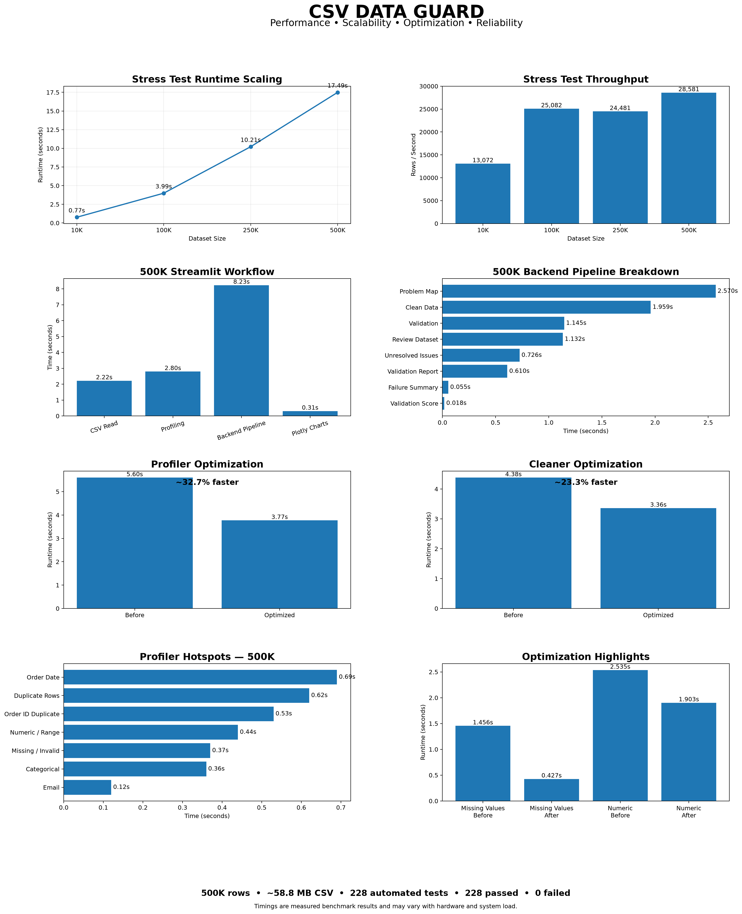
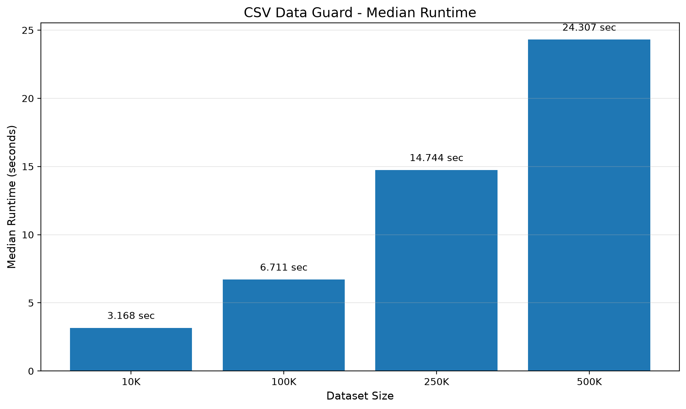
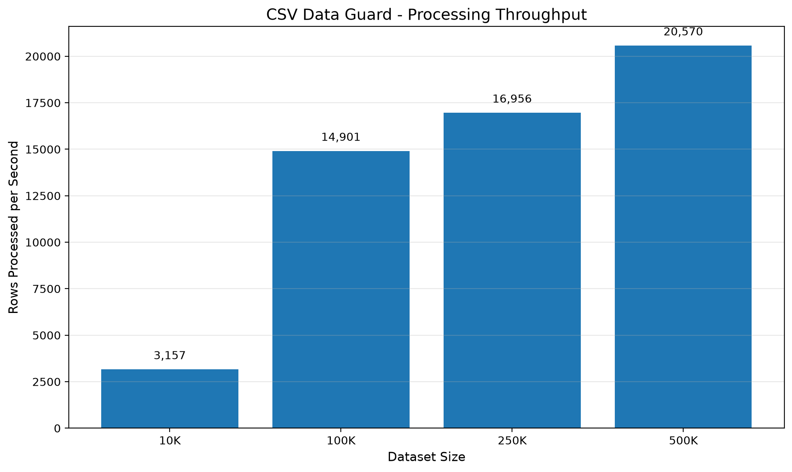

# CSV Data Guard — Performance Report

This report summarizes the stress-test, runtime, throughput, backend, UI, optimization, and reliability results collected during the development and validation of **CSV Data Guard**.

---
## Benchmark Environment

Performance measurements are representative and may vary depending on
hardware, operating system, Python version, library versions, and system load.

Test environment used for the reported benchmarks:

- Operating System: Windows 11
- OS Build: Windows-11-10.0.26300-SP0
- Processor: Intel64 Family 6 Model 186 Stepping 3, GenuineIntel
- Python: 3.13.9
- pandas: 3.0.6
- NumPy: 2.5.3
- Pandera: 0.33.1
- Benchmark method: median of repeated runs where applicable
- Dataset sizes tested: 10K, 100K, 250K, and 500K rows
- 500K CSV size: approximately 58.8 MB

The reported timings should therefore be treated as representative
performance observations rather than guaranteed execution times.

---

## Performance Summary

| Metric | Result |
|---|---:|
| Maximum Tested Dataset | 500K rows |
| Approx. CSV Size | 58.8 MB |
| Automated Tests | 228 passed |
| Failed Tests | 0 |
| Pipeline Failures During Final Smoke Test | 0 |
| UI Responsive at 500K | Yes |

---

## 1. Performance Dashboard

The dashboard below provides a consolidated view of the major performance metrics collected during testing and optimization.



---

## 2. Median Runtime by Dataset Size

This chart shows how processing time changes as dataset size increases.



The benchmark demonstrates the expected increase in runtime as the number of rows grows, while the pipeline remains operational through the 500K-row test.

---

## 3. Processing Throughput

This chart shows the number of rows processed per second across the tested dataset sizes.



Throughput remains strong across the larger datasets, demonstrating that the pipeline continues to process substantial row volumes as dataset size increases.

---

## 4. Final 500K Streamlit Smoke Test

The final application smoke test used a dataset containing approximately:

- **500,000 rows**
- **58.8 MB CSV size**

The application successfully completed the full workflow without crashing.

### Representative Timings

| Stage | Approx. Time |
|---|---:|
| CSV Upload / Read | ~2.2 sec |
| Dataset Profiling | ~2.8–3.9 sec |
| Backend Pipeline | ~8.2 sec |
| Plotly Chart Construction | ~0.3 sec |

The tested workflow included:

- CSV upload
- Front-door validation
- Dataset profiling
- Automated cleaning
- Schema validation
- Problem-map generation
- Validation reporting
- Review-dataset generation
- Quality-gate evaluation
- Plotly chart rendering

---

## 5. Backend Pipeline Performance

The final 500K pipeline execution produced the following representative stage timings:

| Pipeline Stage | Time |
|---|---:|
| Prepare Original Data | 0.0015 sec |
| Clean Data | 1.9592 sec |
| Find Unresolved Cleaning Issues | 0.7257 sec |
| Calculate Cleaning Score | 0.0000 sec |
| Validate Cleaned Data | 1.1452 sec |
| Create Problem Map | 2.5704 sec |
| Calculate Validation Score | 0.0178 sec |
| Count Valid / Invalid Rows | 0.0148 sec |
| Summarize Validation Failures | 0.0549 sec |
| Quality Gate | 0.0000 sec |
| Create Validation Report | 0.6103 sec |
| Create Review Dataset | 1.1322 sec |

**Total DataFrame Pipeline: ~8.23 seconds**

The largest contributors were problem-map generation, cleaning, validation, and review-dataset generation.

---

## 6. Profiler Optimization

Profiler performance was improved through targeted optimization of several high-cost operations.

Optimization work included:

- Faster numeric conversion
- Vectorized categorical checks
- Optimized email-domain validation
- Improved date-format routing
- Duplicate-row analysis
- Duplicate Order-ID analysis

Representative benchmark observations showed the profiler moving from roughly:

```text
Before optimization: ~5.6 sec
Optimized median:    ~3.8 sec
