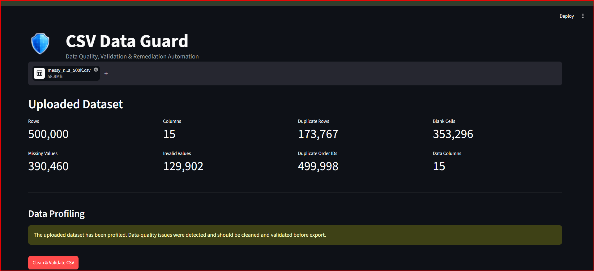
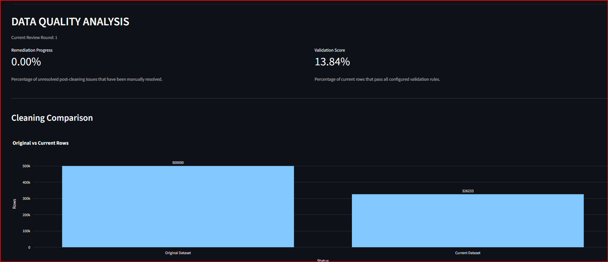
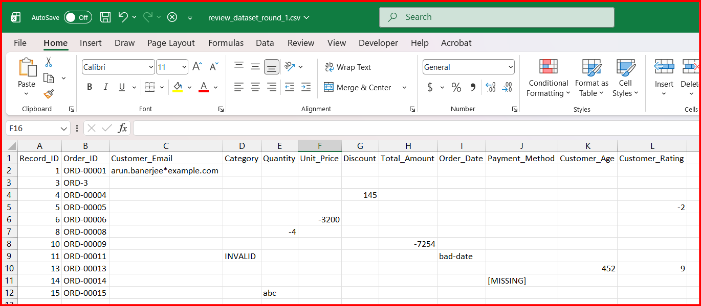
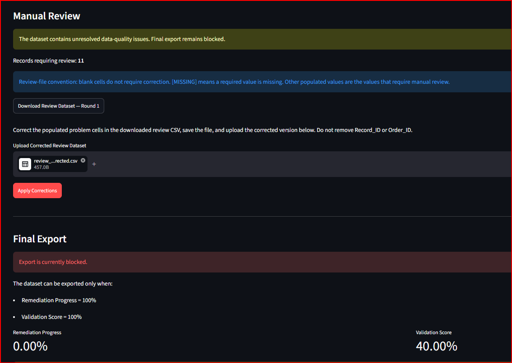
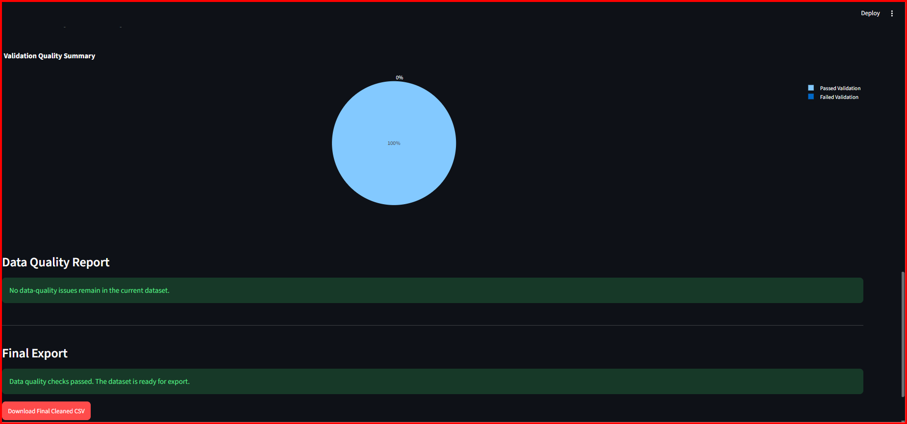
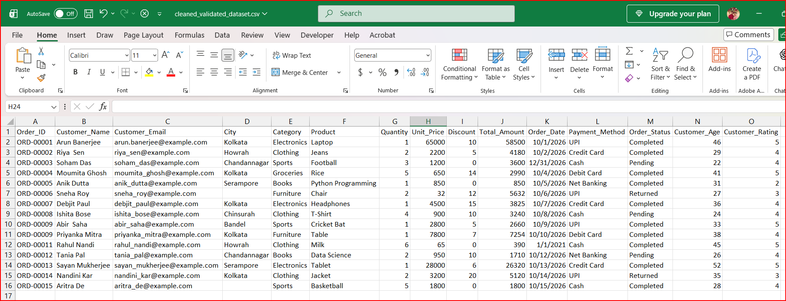

<p align="center">
  
</p>

<h1 align="center">CSV Data Guard</h1>

<p align="center"><strong>Data Quality, Validation & Remediation Automation</strong></p>

<p align="center">
A Python + Streamlit application for profiling, cleaning, validating, remediating,
reporting, and safely exporting CSV datasets through a strict data-quality workflow.
</p>

---

## Overview

**CSV Data Guard** is a data-quality and ETL validation framework designed to process messy CSV datasets through a controlled and testable workflow.

Rather than cleaning a file and assuming the output is valid, the application separates:

- Profiling
- Cleaning
- Validation
- Remediation
- Reporting
- Quality-gate enforcement
- Final export

### Workflow

```text
Upload
  ↓
Profile
  ↓
Clean
  ↓
Calculate Remediation Progress
  ↓
Validate
  ↓
Calculate Validation Score
  ↓
Data Quality Check
  ↓
Export if both scores = 100%
  ↓
Otherwise Generate Review Dataset
  ↓
Manual Correction
  ↓
Merge Corrections
  ↓
Revalidate
```

---

## Why This Project?

Real-world CSV datasets commonly contain missing values, duplicate rows, malformed emails, invalid dates, inconsistent casing, invalid categories, range violations, duplicate identifiers, and unresolved post-cleaning issues.

A cleaning script may transform some of these values, but that does not guarantee that the resulting dataset satisfies all business and schema rules.

CSV Data Guard uses a controlled workflow:

**Profiling → Cleaning → Validation → Remediation → Quality Gate → Export**

Automatic cleaning is intentionally conservative. Only safe and deterministic transformations are applied.

For example, an invalid value such as `bad-email` is **not** reconstructed from the customer's name. It remains invalid until it is validated and, when necessary, corrected manually.

---

## Key Features

### CSV Upload Validation

Before profiling begins, the application checks for:

- `.csv` file extension
- Zero-byte files
- Whitespace-only files
- UTF-8 decoding problems
- Malformed CSV structure
- Blank column names
- Duplicate column names
- Header-only files
- Zero-column datasets
- Missing required columns

### Data Profiling

The profiler identifies:

- Dataset dimensions
- Missing and invalid values
- Duplicate rows
- Duplicate Order IDs
- Invalid email syntax and domains
- Invalid dates
- Numeric range violations
- Invalid categorical values

### Automated Data Cleaning

The cleaner performs deterministic transformations including:

- Missing-value standardization
- Duplicate-row removal
- Text normalization
- Categorical casing normalization
- Numeric conversion
- Supported date parsing
- Email lowercasing
- Known deterministic domain correction
- Supported age-format repair

### Schema Validation

The cleaned dataset is validated with **Pandera**.

Validation includes:

- Required columns
- Strict schema checks
- Data types
- Nullable and non-nullable fields
- Numeric ranges
- Allowed categorical values
- Email syntax and domain
- Order ID format
- Date validation

Example Order ID rule:

```text
^ORD-\d{5}$
```

Example valid value:

```text
ORD-00001
```

---

## Quality Metrics

CSV Data Guard uses two independent quality metrics.

### Remediation Progress

Measures whether all known cleaning and remediation issues have been resolved.

**100% Remediation Progress** means every identified remediation issue has been handled.

### Validation Score

Measures the percentage of current rows that pass all configured validation rules.

**100% Validation Score** means every current row satisfies the validation schema.

A dataset can therefore reach:

```text
Remediation Progress = 100%
Validation Score = 93%
```

and still remain blocked from export.

---

## Quality Gate

Final export is allowed only when all conditions are satisfied:

```text
Remediation Progress = 100%
AND
Validation Score = 100%
AND
Validation succeeds
```

If any condition fails, the final clean CSV cannot be exported.

---

## Sparse Review Dataset

When unresolved issues remain, CSV Data Guard generates a sparse review file containing:

**Record_ID + only the columns requiring correction**

| Record_ID | Customer_Email | Customer_Age |
|---:|---|---|
| 12 | bad-email | |
| 25 | | 4@6 |

Review rules:

- **Blank cell** → no correction required
- **`[MISSING]`** → required value is missing
- **Populated invalid value** → manually replace it

This reduces the risk of accidentally modifying valid data.

---

## Safe Correction Merge

Corrections are merged using an internal `Record_ID`.

Only originally problematic fields can be updated. Valid values, unrelated columns, and internal row identity remain protected.

`Order_ID` becomes editable only when its current value is invalid or duplicated.

---

## Multi-Round Remediation

CSV Data Guard supports repeated correction cycles:

```text
Round 1
  ↓
Review Dataset
  ↓
Partial Corrections
  ↓
Revalidation
  ↓
Round 2
  ↓
Remaining Issues
  ↓
Final Corrections
  ↓
100% Remediation Progress
100% Validation Score
  ↓
Export
```

---

## Data Quality Reporting

The application reports unresolved issues including:

- Invalid email syntax
- Invalid email domain
- Invalid Order ID
- Duplicate Order ID
- Missing required values
- Invalid dates
- Numeric range violations
- Invalid categorical values
- Unresolved cleaning problems

When the current dataset is fully resolved, the application displays:

> **No data-quality issues remain in the current dataset.**

---

## Tech Stack

| Area | Technology |
|---|---|
| Core | Python, Pandas, NumPy |
| Validation | Pandera |
| User Interface | Streamlit |
| Visualization | Plotly |
| Testing | Pytest |
| Performance Testing | Custom benchmark and stress-test scripts |

---

## Project Architecture

```text
CSV-Data-Cleaning-Automation/
│
├── assets/
├── data/
├── dataset_generator/
├── pipeline/
│   ├── __init__.py
│   ├── cleaner.py
│   ├── exporter.py
│   ├── orchestrator.py
│   ├── problem_map.py
│   ├── profiler.py
│   ├── reporting.py
│   ├── review.py
│   └── validator.py
│
├── tests/
│   ├── edge_cases/
│   ├── export/
│   ├── failure_recovery/
│   ├── integration/
│   ├── remediation/
│   ├── stress/
│   │   ├── optimization_benchmarks/
│   │   ├── performance_discovery_tests/
│   │   ├── performance_tests/
│   │   └── run_all_stress.py
│   └── unit/
│       ├── cleaner/
│       ├── problem_map/
│       ├── profiler/
│       ├── reporting/
│       ├── review/
│       └── validator/
│
├── app.py
├── .gitignore
├── LICENSE
├── PERFORMANCE_REPORT.md
├── pytest.ini
├── README.md
└── requirements.txt
```

---

## Processing Architecture

```text
CSV Upload
   ↓
Profiler
   ↓
Cleaner
   ↓
Validator
   ↓
Problem Map
   ↓
Reporting
   ↓
Review Dataset
   ↓
Correction Merge
   ↓
Revalidation
   ↓
Exporter
```

The orchestrator coordinates the workflow while the individual modules remain separate and independently testable.

---

## Testing

The project includes automated tests covering:

- Unit testing
- Integration testing
- Remediation testing
- Edge-case testing
- Export testing
- Failure and recovery testing

### Final Regression Result

| Metric | Result |
|---|---:|
| Automated Tests | 228 |
| Passed | 228 |
| Failed | 0 |

The Streamlit workflow was also tested manually through complete end-to-end remediation scenarios.

---

## Pre-Production Defects Found During Testing

End-to-end testing identified several workflow defects that were not obvious from isolated unit tests.

### 1. Order_ID Remediation Dead-End

An invalid `Order_ID` could block export while failing to appear in a later review dataset.

The review logic was changed so that `Order_ID` becomes editable only when the current value is invalid or duplicated.

### 2. Over-Aggressive Email Reconstruction

The cleaner originally reconstructed malformed email addresses from customer names.

That behaviour was removed because it could invent customer data. Invalid emails are now preserved for validation and manual remediation.

### 3. Historical Issues After Successful Remediation

The final UI previously displayed historical problems even after the current dataset passed the quality gate.

The UI was changed so the final report reflects the **current dataset state**.

### 4. Duplicate Correction Submission Risk

Repeated correction submissions could trigger unintended workflow behaviour.

A busy-state lock and correction request identifier were introduced to prevent duplicate submissions.

---

## Performance & Scalability

CSV Data Guard was tested with large CSV datasets.

### Final 500K Smoke Test

| Metric | Result |
|---|---:|
| Rows | ~500,000 |
| CSV Size | ~58.8 MB |
| Application Crash | No |
| Pipeline Exception | No |
| UI Remained Responsive | Yes |

Representative timings:

| Stage | Approx. Time |
|---|---:|
| CSV Upload / Read | ~2.2 sec |
| Dataset Profiling | ~2.8–3.9 sec |
| Backend Pipeline | ~8.2 sec |
| Plotly Chart Construction | ~0.3 sec |

Runtime varies with machine load and execution conditions.

For detailed stress-test charts, optimization comparisons, and backend timing breakdowns, see:

### [View the Performance Report](PERFORMANCE_REPORT.md)

---

## Performance Optimization Highlights

### Missing-Value Standardization

| Version | Time |
|---|---:|
| Before Optimization | ~1.46 sec |
| After Optimization | ~0.43 sec |

**Improvement: approximately 70%**

### Numeric Cleaning

| Version | Time |
|---|---:|
| Before Optimization | ~2.54 sec |
| After Optimization | ~1.90 sec |

**Improvement: approximately 25%**

Profiler optimization also included:

- Faster numeric conversion
- Vectorized categorical validation
- Optimized email-domain checking
- Improved date-format routing
- Duplicate-analysis benchmarking

---

## Stress Testing

Final benchmark scripts are stored under:

```text
tests/stress/optimization_benchmarks/
```

The retained benchmarks cover:

- Profiler performance
- Cleaner performance
- Problem-map performance
- Reporting performance
- Review-generation performance
- Pipeline performance

---

## Application Screenshots

Store final screenshots under:

```text
assets/screenshots/
```

Recommended screenshots:


## Application Screenshots

### 1. Upload and Data Quality Analysis



---

### 2. Data Quality Analysis & Validation Results



---

### 3. Generated Sparse Review Dataset



---

### 4 Manual Review & Apply Corrections



---

### 5. Quality Gate Passed & Final Export



---

### 6. Final Cleaned & Validated Dataset



---

## Installation

Clone the repository:

```bash
git clone <your-repository-url>
```

Move into the project directory:

```bash
cd CSV-Data-Cleaning-Automation
```

Create a virtual environment:

```bash
python -m venv .venv
```

### Windows

```bash
.venv\Scripts\activate
```

### Linux / macOS

```bash
source .venv/bin/activate
```

Install dependencies:

```bash
pip install -r requirements.txt
```

---

## Running the Application

```bash
streamlit run app.py
```

---

## Running the Tests

```bash
python -m pytest
```

Expected result:

```text
228 passed
```

---

## Design Principles

CSV Data Guard follows these engineering principles:

- Deterministic cleaning
- Conservative automatic correction
- Separation of cleaning and validation
- Validation after transformation
- Protection of valid data during remediation
- Explicit quality gates
- Modular architecture
- Repeatable automated testing
- Measurable performance
- Large-scale workflow testing

---

## Project Status

| Component | Status |
|---|---|
| Core Pipeline | ✅ Complete |
| CSV Profiling | ✅ Complete |
| Automated Cleaning | ✅ Complete |
| Schema Validation | ✅ Complete |
| Problem Mapping | ✅ Complete |
| Reporting | ✅ Complete |
| Manual Remediation | ✅ Complete |
| Multi-Round Remediation | ✅ Complete |
| Quality Gate | ✅ Complete |
| CSV Export | ✅ Complete |
| Streamlit UI | ✅ Complete |
| Automated Testing | ✅ Complete |
| Performance Optimization | ✅ Complete |
| 500K Smoke Testing | ✅ Complete |

---

## Future Enhancements

Potential future improvements include:

- Configurable validation schemas
- Dynamic column mapping
- Additional text encodings
- Database input and output
- Cloud-storage integration
- Email delivery
- Downloadable PDF quality reports
- Configurable remediation rules
- Docker deployment
- CI/CD integration
- Hosted demo deployment

These are outside the current stable project scope.

---

## License

This project is licensed under the **MIT License**.

See the [LICENSE](LICENSE) file for details.

---

## Author

**Nirjhar Dutta**<br>
Python Developer | Data Quality Automation | Data Analysis

---

## Project Summary

CSV Data Guard demonstrates an end-to-end data-quality workflow combining:

- Data Profiling
- Data Cleaning
- Schema Validation
- Manual Remediation
- Quality Gates
- Automated Testing
- Performance Optimization
- Large-Scale CSV Processing

The project focuses on building a reliable, testable, and measurable data-quality pipeline rather than only performing basic CSV transformations.
